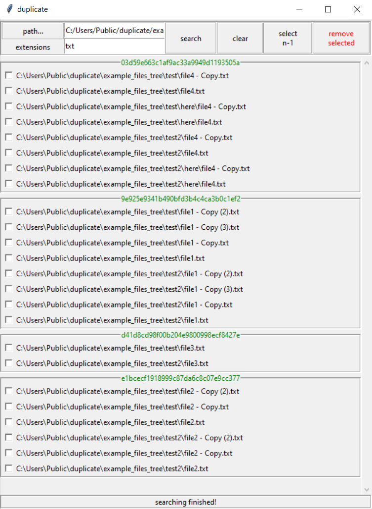

# duplicate

files duplicate viewer

## install

```
pip install git+https://github.com/streanger/duplicate.git
```

## usage

```bash
# from cli
duplicate

# as module
python -m duplicate
```

```python
# from python
import duplicate
duplicate.gui()
```

## screenshots



## ideas

- faster search

- faster window moving while many rows exists

- green progressbar for search

- sync between search and gui

- resizable filedialog (if possible)

- after method in tkinter if needed

- reset scrollbar for maximized windows should be fixed

- more information on the bottom info label

- better threads handling; maybe use of queue

- utils module for class staticmethods

- pylint & black todo

- screenshot(s) to upload (+)
